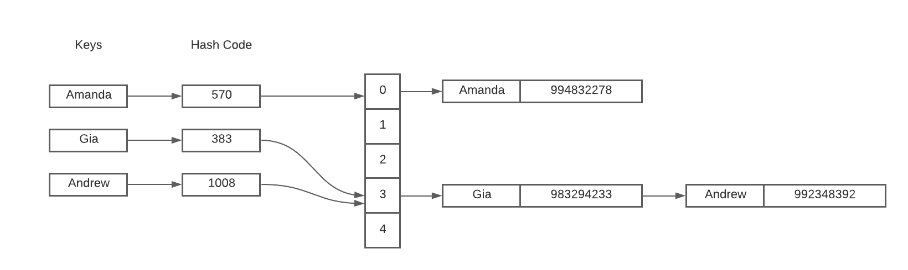

# Hash Table

Hash Table é uma estrutura de dados chave valor em que conseguimos consultar valores de uma forma muito eficiente. No Python, essa estrutura é conhecida como *Dicionário*, que podemos instanciar através de colchetes *{}* ou pela função `Dict()` do Python. 

Essa estrutura é muito interessante porque podemos utilizar qualquer tipo de valor como chave, seja uma string, um float ou até mesmo um valor booleano. Um exemplo prático da utilização de uma Hash Table seria caso de criar uma agenda telefônica, ao invés de criar duas listas poderiamos criar uma agenda através de um dicionário da seguinte maneira:

~~~python
agendaTelefonica = { "Ana": 991320229, "Eduarda": 987462374 }
~~~
E para consultar esses valores, no Python, utilizamos colchetes e ao invés do index como fazemos nas listas utilizamos a chave. Então se quisessemos consultar o telefone de Eduarda fariamos:

~~~python
print(agendaTelefonica["Eduarda"])
~~~

### *Mas por que essa estrutura é muito eficiente para consulta?*

Para entendermos melhor o funcionamento da Hash Table precisamos entender um pouco como ela é implementada. A inserção de uma chave na Hash Table funciona da seguinte maneira:

1. Primeiramente é computado o Hash Code da chave a ser inserida, o Hash Code pode ser computado de diversas maneiras, um exemplo simples seria a soma dos valores ASCII de todos caracteres.
2. Em sequência é mapeado hash code no index do array. Isso pode ser feito por simplesmente pegar o resto da divisão do Hash Code pelo tamanho do array alocado para a Hash Table.
3. E por fim armazenamos a chave e o valor nesse index. Note que dois Hash Codes diferentes podem ser mapeados no mesmo index como ocorre na imagem a seguir com as chaves "Gia" e "Andrew", quando isso ocorre chamamos de *colisão*, existem varias maneiras de se tratar colisões, uma delas é no index haver uma lista encadeada de chaves e valores. 

Para realizar a consulta de uma chave na Hash Table, o processo é repetido. Primeiramente computado o hash code a partir da chave, depois é computado o index a partir do hash code, e por fim procura-se na lista encadeada a chave com o mesmo valor que estamos procurando.

Assim, se o número de colisões for alta, o pior caso de tempo será O(N), sendo N o número de chaves da Hash Table. Entretanto, nós geralmente assumimos que uma boa implementação de uma Hash Table tem um número mínimo de colisões, logo o a complexidade de tempo de uma consulta é O(1).  

Por tanto, no caso de uma agenda telefônica, o uso de um dicionário é mais eficiente se comparado a usar duas listas uma para os nomes e outro para os telefones, pois ao realizar uma consulta utilizando listas precisariamos percorrer a lista de nomes para achar o index do nome da pessoa que estamos procurando, enquanto no dicionário isso não é necessário.

### Métodos úteis de dicionários

Método   | Função
--------- | ------
dict.keys() | Retorna lista de chaves do dicionário
dict.values() | Retorna lista de valores do dicionário
dict.items() | Retorna uma lista com todos os pares
dict.pop(chave) | Obtém o valor correspondente a chave e remove o par chave/valor do dicionário
dict1.update(dict2) | Junta dois dicionários
